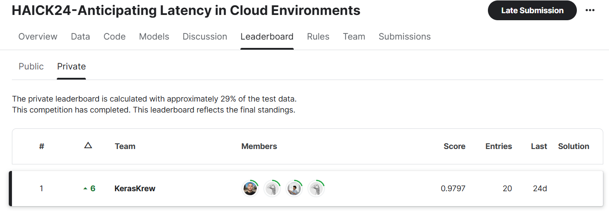

# Haick-2024-Challenge-3-Wining-Notebook
Here you find the notebooks I made for my participation in HAICK2024 alongside my team KerasKrew in the challenge of Latency Anticipation in cloud environments.

# Challenge Description :

## Overview :
Welcome to the Anticipating Latency in Cloud Environments competition!

Cloud-native and containerization technologies have revolutionized application development and deployment paradigms. Embracing a microservice architecture, applications are packaged into containers and deployed across centralized or edge cloud environments. However, predicting latency, or the response time of these applications to user requests, remains a critical challenge.

## Objective :
In this challenge, you will analyze datasets collected from Python-based web servers deployed in cloud-native environments. The goal is to develop predictive models that accurately forecast response times (latency) for web server requests under varying resource allocations and request loads.

#### Special shoutout to KerasKrew Team :
- Boussenah Maria
- Guendouz Mehdi
- Saidani Farid

</img>
